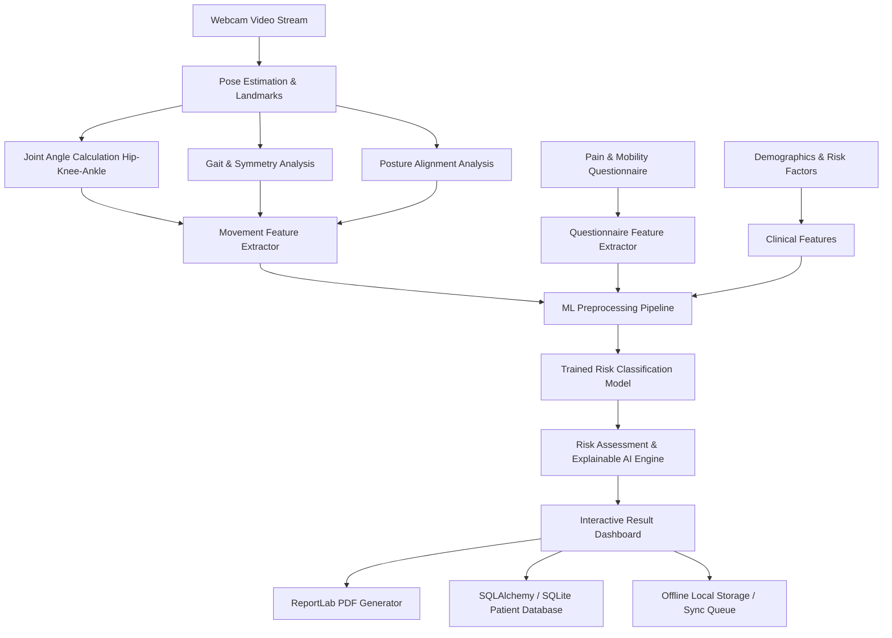

# OA-Sense AI: AI-Assisted Early Osteoarthritis Risk Screening System

> **IMPORTANT MEDICAL NOTICE & SAFETY DISCLAIMER:**  
> OA-Sense AI is strictly an **AI-assisted screening and risk-assessment tool**, **NOT a medical diagnosis system**. It is engineered to assist healthcare workers in primary healthcare centres, rural health camps, and community outreach in identifying preliminary risk markers. **Never claim or interpret findings as a definitive clinical diagnosis.** Results must always be verified through clinical evaluation and radiographic confirmation by a qualified orthopedic specialist or physician.

---

## 1. System Architecture



### Biomechanical Pipeline Flow
1. **Camera Feed & Pose Estimation**: Browser captures webcam video at 30 FPS. MediaPipe Pose tracks 33 anatomical landmarks (key tracking nodes: Shoulders, Hips, Knees, and Ankles).
2. **Joint Angle Calculation**: Evaluates the 2D planar angle at the knee vertex formed by vectors $\vec{u} = \text{Hip} - \text{Knee}$ and $\vec{v} = \text{Ankle} - \text{Knee}$:
   $$\theta = \arccos\left(\frac{\vec{u} \cdot \vec{v}}{\|\vec{u}\| \|\vec{v}\|}\right)$$
3. **Gait & Dynamic Symmetry**: Assesses peak flexion timing, bilateral ROM difference, cadence (steps/min), movement consistency, and normalized smoothness (jerk variance).
4. **Posture Analysis**: Analyzes bi-acromial shoulder tilt, pelvic alignment, and trunk vertical inclination.
5. **Machine Learning Model**: Normalizes and scales combined questionnaire and computer-vision features to classify OA risk level (`Low Risk`, `Moderate Risk`, `High Risk`) with probabilistic confidence.
6. **Explainable AI**: Decomposes decision weights into transparent risk drivers (Pain Intensity, ROM Restriction, Gait Asymmetry, Posture Deviation).
7. **Clinical Screening Report**: Compiles results into a multi-page PDF document with recommendations and safety disclaimers using ReportLab.

---

## 2. Technology Stack

- **Frontend**: React 18, TypeScript, Vite, Tailwind CSS, Recharts, Lucide React icons, MediaPipe Pose CDN.
- **Backend**: Python 3.11+, FastAPI, Uvicorn, SQLAlchemy ORM, SQLite database, Pydantic v2, PyJWT / bcrypt.
- **AI & Computer Vision**: OpenCV, MediaPipe Pose, NumPy, Pandas, Scikit-learn (Logistic Regression, Random Forest, Gradient Boosting), Joblib.
- **Reporting**: ReportLab PDF generator.
- **Real-Time Telemetry**: WebSocket (`/ws/movement-analysis`).

---

## 3. Features

- **Staff Authentication**: Role-based access for healthcare workers with single-click Demo Login.
- **Cohort Dashboard**: Overview of total patients, daily screenings, risk distribution donut chart, and high-risk case highlights.
- **Patient Registration**: Captures demographics, occupational loading, and clinical joint injury history.
- **Functional Questionnaire**: 9-point symptom questionnaire evaluating pain frequency, stair difficulty, and continuous 0-10 visual pain/mobility scales.
- **3-Test Movement Protocol**:
  1. *Test 1: Knee Flexion / Extension* ("Slowly bend and straighten your knee")
  2. *Test 2: Sit-to-Stand* ("Stand up from a chair and sit down safely")
  3. *Test 3: Walking Test* ("Walk naturally in front of the camera")
- **Live Visual Feedback**: Dynamic skeleton overlay, real-time knee angle degrees, FPS indicator, and active motion detector.
- **Explainable AI (XAI)**: Identifies top risk contributors and apportions risk between questionnaire burden vs. computer-vision movement limitation.
- **Longitudinal History**: Patient profile timeline tracking progress across screening sessions.
- **Offline-First Resilience**: Local storage queue allowing full screening execution during network blackouts with automated batch synchronization upon reconnection.
- **Multilingual Support**: Real-time language switching between English (`EN`) and Hindi (`हिंदी`).

---

## 4. Installation & Setup

### Prerequisites
- Python 3.11+ (Python 3.14 compatible)
- Node.js LTS (v20+ or v24+) & npm
- Git

### Backend Setup
```bash
# Navigate to backend directory
cd backend

# (Optional) Create and activate virtual environment
python -m venv venv
# On Windows:
venv\Scripts\activate
# On Linux/macOS:
source venv/bin/activate

# Install dependencies
pip install -r requirements.txt

# Run database setup & train ML models
python ../ml/train.py

# Start FastAPI backend server
python run.py
# Or directly with uvicorn:
uvicorn app.main:app --reload --port 8000
```
Backend will be available at: `http://127.0.0.1:8000`  
Interactive Swagger API docs: `http://127.0.0.1:8000/docs`

### Frontend Setup
```bash
# Navigate to frontend directory
cd frontend

# Install node dependencies
npm install

# Start Vite development server
npm run dev
```
Frontend will be available at: `http://localhost:5173`

---

## 5. Demonstration Account & Demo Mode

The application includes pre-configured demo credentials and sample patients:
- **Email:** `demo@oasense.ai`
- **Password:** `demo123`
- *Or click the "One-Click Demo Login" button on the login screen.*

> **DEMO DATA DISCLAIMER:**  
> The demonstration dataset was generated synthetically to validate system architecture, kinematic equations, and classification pipelines without violating patient privacy laws. The predictions are marked as `DEMO / RESEARCH PROTOTYPE` and must not be used for clinical decision-making.

---

## 6. Automated Testing

To run the complete test suite verifying angle formulas, feature extraction, ML inference, and API endpoints:
```bash
cd oa-sense-ai
$env:PYTHONPATH = "backend"   # Windows PowerShell
python -m pytest tests/ -v
```
All 14 automated test cases pass with 100% success rate:
- Geometric joint angle calculations (180°, 90°, 45°, 135°)
- Posture tilt and alignment metrics
- Demographics and activity level preprocessing
- Model persistence and inference validation
- Authentication and token generation
- Patient creation, screening ingestion, and report generation

---

## 7. API Documentation

| Method | Endpoint | Description |
|---|---|---|
| `POST` | `/api/auth/login` | Authenticates healthcare staff; returns JWT access token |
| `GET` | `/api/dashboard/statistics` | Retrieves cohort counts, risk distribution, and recent activity |
| `GET` | `/api/patients` | Lists patients with optional search and risk filter |
| `POST` | `/api/patients` | Registers a new patient record |
| `GET` | `/api/patients/{id}` | Retrieves patient demographics and historical screening timeline |
| `POST` | `/api/analysis/questionnaire` | Computes symptom score from questionnaire inputs |
| `POST` | `/api/analysis/movement` | Computes ROM, gait symmetry, and smoothness from telemetry |
| `POST` | `/api/analysis/predict` | Executes ML risk classification |
| `POST` | `/api/screenings` | Persists completed screening and movement frames |
| `POST` | `/api/screenings/sync` | Batch synchronization endpoint for offline records |
| `POST` | `/api/reports/generate` | Generates a ReportLab PDF screening report |
| `GET` | `/api/reports/{id}` | Downloads the generated PDF report |
| `WS` | `/ws/movement-analysis` | WebSocket stream for live pose feedback and frame telemetry |

---

## 8. Docker Deployment

To launch the full stack with Docker Compose:
```bash
docker compose up --build
```
- Frontend UI: `http://localhost:3000`
- Backend API: `http://localhost:8000`

---

## 9. Known Limitations & Future Improvements

1. **Monocular 2D Pose Limitations**: Standard 2D camera angles can experience perspective foreshortening if the subject does not face perpendicular to the lens. Future work will integrate depth sensors or multi-view triangulation.
2. **Lighting and Contrast**: Extreme backlighting in rural outdoor camps can degrade landmark confidence. Future enhancements include automatic lighting quality warnings.
3. **Clinical Validation Dataset**: Synthetic demo models can be swapped seamlessly by replacing `oa_risk_model.joblib` with models trained on multi-center clinical cohorts (e.g. OAI - Osteoarthritis Initiative dataset).
